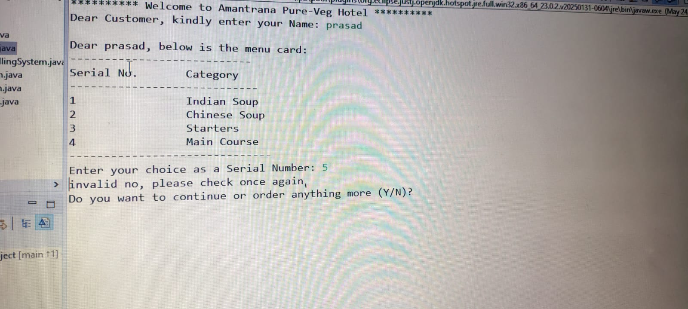
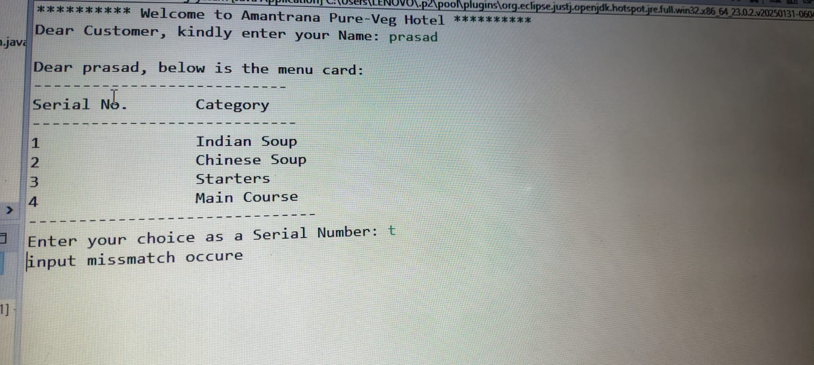

🏨 Hotel Billing System – Java OOP's Project
This is a simple Java-based Hotel Billing System project developed using core Java concepts. The system simulates a hotel ordering system where the user can view the menu, place orders, and get the final bill summary. The project is designed to demonstrate the use of Object-Oriented Programming in Java such as classes, objects, collections (ArrayList),oop's piller and user interaction using Scanner.

👨‍💻 Features
Takes user name as input

Displays categorized menu card:

1. Indian Soups

2. Chinese Soups

3. Starters

4. Main Menu

User selects individual items from each menu

Collects selected items in an ArrayList

Calculates total bill dynamically

Displays final order summary and total amount

🧑‍💻 Technologies Used
💻 Language: Java

🧠 Concepts: OOP (Classes, Objects, Encapsulation, Polymorphisum, Abstraction, Interface)

📦 Data Structure: ArrayList,collection,java 8

🔣 Input Handling: Scanner

🧾 Sample Flow
Enter your name: Prasad

*** Welcome to Our Hotel, Prasad! ***
Please choose a menu category:
1. Indian Soups
2. Chinese Soups
3.  Starters
4. Main Menu

Enter your choice: 3

-- Starters Menu --
1. Veg Cutlet - ₹80
2. Alu Tikka - ₹120
...

Do you want to continue ordering? (yes/no)
yes(repeat)
no
Items ordered:
1. alu Tikka - ₹120
2. Veg Noodles - ₹100

Total Bill: ₹220

🧾 Sample Output

********** Welcome to Amantrana Pure-Veg Hotel **********
Dear Customer, kindly enter your Name
Prasad
...
...
Total Bill Amount (including 18% GST) is = 260.4$
**********  Thank You For Visiting Our Hotel **********

## screenshot images

>  
> 

> >  

🚀 Future Enhancements
✅ Add validations for incorrect inputs.

🔒 Implement login/authentication.

💾 Store order history in a file or database.

🖥️ Add a GUI using JavaFX or Swing.

📜 License
This project is for educational use. You are free to modify and reuse the code.
